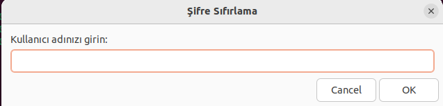
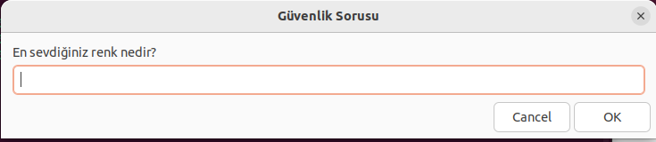
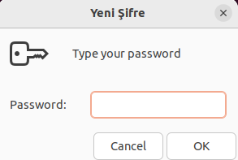

# Zenity ile Kullanıcı Envanter Yönetim Sistemi

Bu proje, Zenity kullanılarak geliştirilmiş kapsamılı bir **Kullanıcı ve Envanter Yönetim Sistemi**dir. Kullanıcıların giriş yapabileceği, yeni kayıt oluşturabileceği, şifre sıfırlayabileceği ve envanter yönetimi yapabileceği bir sistem sunar.

---

## **Özellikler**

### **Kullanıcı Yönetimi**
- **Kullanıcı Girişi**: Kullanıcı adı ve şifre ile güvenli giriş.
- **Yeni Kullanıcı Kaydı**: Yeni bir kullanıcı oluşturma oluşturulan kullanıcılar `kullanici.csv` dosyasında saklanır.
- **Şifre Sıfırlama**: Güvenlik sorusu doğrulamasıyla şifre yenileme.
- **Blokeli Hesap Yönetimi**:
  - 3 hatalı girişten sonra hesap kilitlenir.
  - Bloklu kullanıcıları listeleme ve blok kaldırma bloklu kullanıcılar `kilitli_kullanicilar.csv` adlı dosyada saklanır.

### **Envanter Yönetimi**
- **Ürün Ekle**: Envantere yeni ürün eklenir.
- **Ürün Listele**: Mevcut ürünlerin listesi görüntülenir.
- **Ürün Güncelle**: Envanterdeki bir ürünün bilgileri (stok, fiyat) güncellenir.
- **Ürün Sil**: Belirtilen bir ürün envanterden kaldırılır.

### **Hata Loglama ve Raporlama**
- **Hata Loglama**: Hatalı girişler `log.csv` dosyasında saklanır.
- **Raporlama**:
  - Belirli tarih aralıklarında envanter hareketleri.
  - Blokeli hesaplar ve kayıtlı kullanıcılar listesi.
 
---

## **Nasıl Çalıştırılır?**

1. Github'da bulunan `envanter.sh` ve `kullanici_giris.sh` dosylarını indirin ve bir klasöre koyunuz proje dizininde gözüken diğer dosyaları koymanıza gerek yok zaten onlar sistem çalıştırıldığında otomatik olarak yüklenecektir:

2. Script dosyalarını çalıştırılabilir yapın:
    ```bash
    chmod +x envanter.sh kullanici_giris.sh
    ```

3. Sistemi proje dosyalarını yüklediğiniz dizinde başlatın:
    ```bash
    ./Proje_Dosyası/envanter.sh
    ```

---

## **Kullanım Talimatları**

### **1. Giriş Ekranı**
Sistem başlatıldığında ilk olarak giriş ekranıyla karşılaşırsınız.


- **Giriş Yap**: Kullanıcı adı ve şire ile giriş yapabilirsiniz.
- **Kayıt Ol**: Yeni bir kullanıcı oluşturabilirsiniz.
- **Şifre Sıfırla**: Şifrenizi unuttuysanız güvenlik sorusuyla beraber şifreyi sıfırlayabilirsiniz.

---

### **2. Envanter Yönetim Menüsü**
Giriş yapıldığında envanter yönetimi ana menüsü karşınıza gelir.


#### **İşlemler**:
- Ürün ekleme, listeleme, güncelleme ve silme.
- Stok analiz raporları.
- Kullanıcı ekleme, listeleme, ve silme.
- Bloklu kullanıcıları listeleme ve blok kaldırma.
- Disk kullanımı, disk yönetimi ve hataları

### **4. Şifre Sıfırlama**
Şifre unutma durumunda şifre sıfırlama işemi aşağıdaki sorular yardımıyla yapılır.





- Kullanıcı adı girilir.
- Güvenlik sorusu doğrulanır.
- Yeni bir şire belirlenir.

---

## **Proje Yapısı**
Projeyi çalıştırmak için `envanter.sh` ve `kullanici_girisi.sh` dosyalarını indirmemiz yeterli olur prohram çalıştığında diğer dosylara otomatik olarak yüklenecektir proje dizinimizin yapısı aşağıdaki şekildedir

```
ProjeAdi/
├── envanter.sh         
├── kullanici_girisi.sh 
├── depo.csv              
├── kullanici.csv          
├── log.csv           
├── kilitli_kullanicilar.csv
├── images/              
├── README.md              
```

## **Video Tanıtım**

Proje ekran görüntüleri yetmediği durumda arayüzümüzün nasıl kullanıldığını anlatan videoya aşağıdaki linkten ulaşabilirsiniz:

[Proje Tanıtım Videosu](https://example.com/video)

---
## Değerlendirme Soruları

1. **Proje sırasında karşılaştığınız en büyük teknik sorun neydi ve nasıl çözdünüz?**
   - Projeyi yaparken yaşadığım en büyük sorunlardan bir tanesi bash scriptini yazarken yaşadığım sözdizimi hatalarıydı projemde mantıksal hatalar olmamasına rağmen fazla ya da eksik boşluk bırakmalardan sürekli hatalar alıyordum bu hataların çoğunu kodu analiz ederek veya bazı çevrim içi kaybnaklar yardımıyla hatalarımı düzelttim.

2. **Zenity kullanırken sizi en çok zorlayan kısım hangisiydi?**
   - Zenity’nin sınırlı bileşenleri ve özelleştirilebilmesi zorluk oluşturdu. Basit arayüzlerle sınırlı kaldım, ancak yinede araştırma yaparak kullanabildiğim bileşenler kullandım.

3. **Bir hatayla karşılaştığınızda bunu çözmek için hangi adımları izlediniz?**
   - Hata mesajlarını `log.csv` dosyasından inceledim, hatalı kodu analiz ettim, çevrimiçi kaynakları kontrol ettim ve hatayı izole ederek çözdüm.

4. **Ürün güncelleme fonksiyonunu geliştirirken, bir ürünün adı aynı olsa da farklı bir kategoride olabileceğini fark ettiniz mi? Bunu nasıl çözdünüz?**
   - Evet, her ürünü benzersiz ID ile tanımladım ve güncelleme işlemi sırasında ürün adı ve kategori kontrolü ekledim.

5. **Eğer bir kullanıcı programı beklenmedik şekilde kapatırsa, veri kaybını önlemek için ne yaptınız?**
   - Programın her işlem sonrasında csv dosyalarına verileri kaydederek veri kaybını önledim
  
---

## Kaynakça 

1. **Zenity Kullanıcı Kılavuzu (İngilizce)**  
   [Zenity Kullanıcı Kılavuzu](https://help.gnome.org/users/zenity/3.32/)  
   Zenity'nin resmi dökümantasyonu, kullanım ve seçenekler hakkında detaylı bilgiler içerir.

2. **Zenity Örnek Formlar (İngilizce)**  
   [Zenity Formlar](https://help.gnome.org/users/zenity/stable/forms.html.en)  
   Zenity ile form oluşturma ve kullanıcı etkileşimi sağlama konusunda örnekler.

3. **Zenity ile Kabuk Programlama (Türkçe)**  
   [Zenity ile Kabuk Programlama](https://wiki.ubuntu-tr.net/index.php?title=Zenity_ile_kabuk_proglamlama)  
   Zenity kullanarak kabuk programlamayı öğrenmek için Türkçe kaynak.


