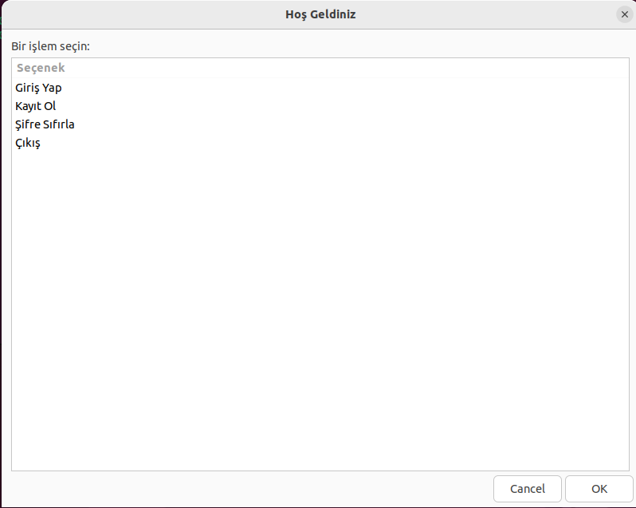
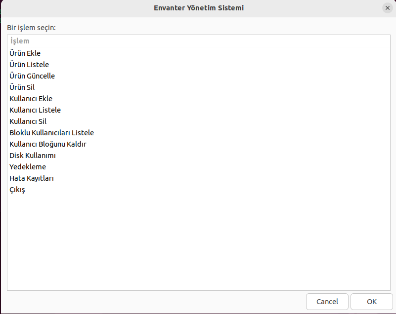

# Kullanıcı ve Envanter Yönetim Sistemi

Bu proje, Zenity kullanılarak geliştirilmiş kapsamılı bir **Kullanıcı ve Envanter Yönetim Sistemi**dir. Kullanıcıların giriş yapabileceği, yeni kayıt oluşturabileceği, şifre sıfırlayabileceği ve envanter yönetimi yapabileceği bir sistem sunar. Özellikle blokeli hesap yönetimi ve güvenlik doğrulamaları ile sistemin güvenliği ön plandadır.

---

## **Özellikler**

### **Kullanıcı Yönetimi**
- **Kullanıcı Girişi**: Kullanıcı adı ve şifre ile güvenli giriş.
- **Yeni Kullanıcı Kaydı**: Yeni bir kullanıcı oluşturma oluşturulan kullanıcılar `kullanici.csv` dosyasında saklanır.
- **Şifre Sıfırlama**: Güvenlik sorusu doğrulamasıyla şifre yenileme.
- **Blokeli Hesap Yönetimi**:
  - 3 hatalı girişten sonra hesap kilitlenir.
  - Bloklu kullanıcıları listeleme ve blok kaldırma bloklu kullanıcılar `kilitli_kullanicilar.csv` adlı dosyada sakalnır.

### **Envanter Yönetimi**
- **Ürün Ekle**: Envantere yeni ürün eklenir.
- **Ürün Listele**: Mevcut ürünlerin listesi görüntülenir.
- **Ürün Güncelle**: Envanterdeki bir ürünün bilgileri (stok, fiyat) güncellenir.
- **Ürün Sil**: Belirtilen bir ürün envanterden kaldırılır.
- **Stok Analizi**:
  - Kritik stok seviyesindeki ürünleri raporlama.
  - Maksimum stoklu ürünleri listeleme.

### **Loglama ve Raporlama**
- **Hata Loglama**: Hatalı girişler `log.csv` dosyasında saklanır.
- **Raporlama**:
  - Belirli tarih aralıklarında envanter hareketleri.
  - Blokeli hesaplar listesi.
 
---

## **Nasıl Kurulur?**

1. Github'da bulunan `envanter.sh` ve `kullanici_giris.sh` dosylarını indirin ve bir klasöre koyunuz proje dizininde gözüken diğer dosyaları koymanıza gerek yok zaten onlar sistem çalıştırıldığında otomatik olarak yüklenecektir:

2. Script dosyalarını çalıştırılabilir yapın:
    ```bash
    chmod +x envanter.sh kullanici_giris.sh
    ```

3. Sistemi proje dosyalarını yüklediğiniz dizinde başlatın:
    ```bash
    ./envanter.sh
    ```

---

## **Kullanım Talimatları**

### **1. Giriş Ekranı**
Sistem başlatıldığında ilk olarak giriş ekranıyla karşılaşırsınız:



- **Giriş Yap**: Kullanıcı adı ve şire ile giriş yapabilirsiniz.
- **Kayıt Ol**: Yeni bir kullanıcı oluşturabilirsiniz.
- **Şifre Sıfırla**: Güvenlik sorusuyla şifrenizi sıfırlayabilirsiniz.

---

### **2. Envanter Yönetim Menüsü**
Giriş başarılı olduğunda envanter yönetimi ana menüsü karşınıza gelir:



#### **İşlemler**:
- Ürün ekleme, listeleme, güncelleme ve silme.
- Stok analiz raporları.
- Kullanıcı ekleme, listeleme, güncelleme ve silme.
- Bloklu kullanıcıları listeleme ve blok kaldırma.
- Disk kullanımı, disk yönetimi ve hataları

### **4. Şifre Sıfırlama**
Giriş ekranındaki "Şifre Sıfırla" seçeneğiyle şunlar yapılabilir:


1. Kullanıcı adı girilir.
2. Güvenlik sorusu doğrulanır.
3. Yeni bir şire belirlenir.

---

## **Proje Yapısı**
Projeyi çalıştırmak için `envanter.sh` ve `kullanici_girisi.sh` dosyalarını indirmemiz yeterli olur prohram çalıştığında diğer dosylara otomatik olarak yüklenecektir proje dizinimizin yapısı aşağıdaki şekildedir

```
ProjeAdi/
├── envanter.sh          # Ana menü ve sistem dosyaları
├── kullanici_girisi.sh # Kullanıcı girişi ve şifre sıfırlama
├── depo.csv               # Ürün bilgileri
├── kullanici.csv          # Kullanıcı bilgileri
├── log.csv                # Sistem logları
├── kilitli_kullanicilar.csv # Kilitli kullanıcılar
├── images/                # Ekran görüntüleri
├── README.md              # Proje dokümanı
```

## **Video Tanıtım**

Proje ekran görüntüleri yetmediği durumda arayüzümüzün nasıl kullanıldığını anlatan videoya aşağıdaki linkten ulaşabilirsiniz:

[Proje Tanıtım Videosu](https://example.com/video)

---

## **Kaynakça** ##

